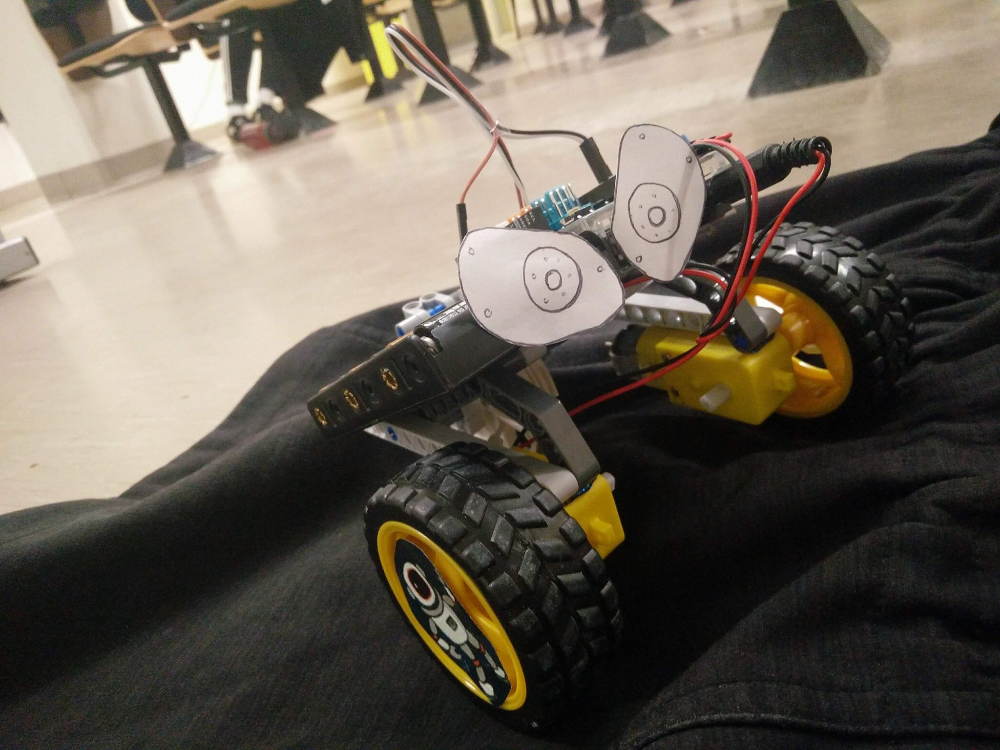

# Carleton Engineering Competition 2017
In 6 hours, build a robot using an arduino that can retrieve supply packages (ping pong balls) on planetary terrain and return them to camp.

## Resources
* arduino uno
* motor shield
* 2 motors
* 2 wheels
* battery pack
* IR remote
* LEGO mindstorm kit (minus the mindstorm)

## Wall-E

